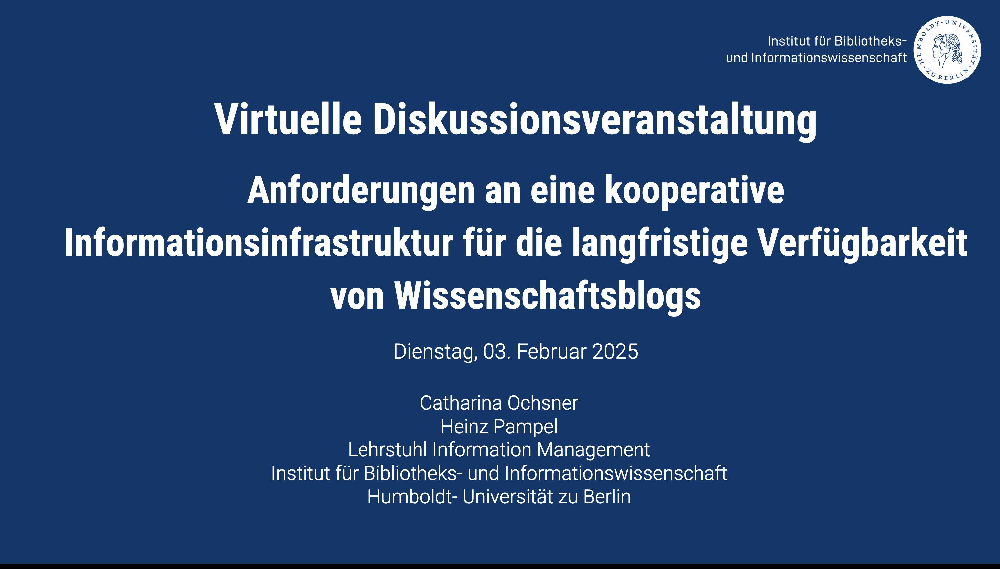

Wissenschaftsblogs ermöglichen es Forschenden, ihre Forschungsergebnisse und forschungsbezogene Themen schnell und offen zu kommunizieren, Diskussionen anzustoßen und den Dialog unter Kolleg:innen sowie zwischen Wissenschaftler:innen und der Gesellschaft zu fördern. Im Vergleich zu traditionellen Formen wissenschaftlicher Veröffentlichungen wie Zeitschriftenartikeln, Konferenzberichten oder Monografien sind Blogs jedoch noch nicht in digitale Forschungs- und Informationsinfrastrukturen integriert. Diese mangelnde Integration birgt das Risiko eines Informationsverlustes [@ochsner2025].

Um diese Probleme anzugehen, wurde im Rahmen des Projekts [Infra Wiss Blogs](https://infrawissblogs.org/) eine virtuelle Diskussionsveranstaltung Blogger:innen und Expert:innen aus Einrichtungen der Informationsinfrastruktur, organisiert. Ziel war es, den im Rahmen des Projekts entwickelten [Anforderungskatalog](https://docs.google.com/document/d/1ckTCisliAciC574pf7kkl1RiTVMMCdN_0wkkluJcofo/edit?usp=sharing) für eine kooperative Informationsinfrastruktur zur langfristigen Verfügbarkeit wissenschaftlicher Blogs vorzustellen und zu diskutieren. Der Katalog basiert auf 13 qualitativen Interviews mit deutschen Wissenschaftsblogger:innen, mit denen deren Anforderungen an eine Informationsinfrastruktur zur Langzeitverfügbarkeit von Wissenschaftsblogs ermittelt werden sollten. Die Diskussion fand in zwei Runden statt. Zunächst konnten Blogger:innen und Expert:innen von Infrastrukturinstitutionen den Katalog mit ihren jeweiligen Kolleg:innen diskutieren, anschließend folgte eine Diskussion im Plenum.

## Blogger:innen

Aus der Sicht der Blogger:innen konzentrierte sich die Diskussion stark auf die Benutzer:innenfreundlichkeit, die rechtliche Klarheit und die Senkung der Hürden für die Teilnahme. Viele Teilnehmer:innen betonten den Bedarf an klareren und praktischeren Anleitungen zur Integration von Metadaten. Obwohl Metadaten allgemein als wesentlich für die Auffindbarkeit und Bewahrung anerkannt sind, fehlt es Blogger:innen oft an konkreten Anweisungen und standardisierten Vorlagen. Es gab einen starken Wunsch nach vordefinierten Metadatenschemata, klaren Erklärungen zu erforderlichen und optionalen Feldern und technischen Lösungen, wie z. B. Plugins, die Teile des Metadaten-Workflows automatisieren könnten. Die Blogger:innen baten zudem um Unterstützung bei der Anwendung von Lizenzen. Darüber hinaus wiesen die Teilnehmer:innen darauf hin, dass die Archivierung von Kommentaren eine Herausforderung darstellen würde, da die Zustimmung der Kommentierenden erforderlich wäre.

## Informationsinfrastruktureinrichtungen

Die Infrastrukturexpert:innen diskutierten über technische und rechtliche Beschränkungen. Ein zentrales Thema war die Versionierung: Es ist nach wie vor unklar, wann eine Änderung an einem Blog oder einem Beitrag als neue Version gelten soll und ob die Versionierung auf der Ebene einzelner Beiträge oder ganzer Blogs erfolgen soll. Außerdem sei die Versionierung bei Blogger:innen noch keine gängige Praxis. Die Teilnehmer:innen waren sich einig, dass Feeds und Protokolle wie RSS oder ActivityPub in erster Linie als Verbreitungsinstrumente dienen und nicht für die Versionierung oder Bewahrung geeignet sind. Stattdessen sollte die Archivierung und Versionskontrolle im Backend des Blogs oder im Content-Management-System erfolgen. Rechtliche Bedenken wurden insbesondere bei Kommentaren geäußert, da die Archivierung von Inhalten vieler verschiedener Autore:innen ohne klare Lizenzen schwierig ist. In der Praxis bedeutet dies oft, dass die Autor:innen einzeln kontaktiert werden müssen, was selten skalierbar ist.

## Plenum

In der Plenardiskussion debattierten die Teilnehmer:innen über die Rolle der Bibliotheken. Einige vertraten die Ansicht, dass Bibliotheken eine stärkere Rolle bei der Veröffentlichung übernehmen könnten, indem sie Blogs hosten, Lizenzen verwalten und Identifikatoren wie Digital Object Identifiers (DOIs) vergeben. Andere sprachen sich für eine begrenztere Rolle aus, bei der Bibliotheken die technische Infrastruktur bereitstellen und die redaktionelle Verantwortung den Blogger:innen überlassen. Es wurde auch angemerkt, dass institutionelle Bürokratie Blogger:innen oft davon abhält, institutionell gehostete Lösungen zu nutzen. Ein Teilnehmer betonte, dass die Dezentralität von Blogs bereits eine Stärke und keine Schwäche sei. Es bestehe kein Bedarf an neuen Erfindungen, sondern vielmehr ein großes Potenzial für die Wiederverwendung und Erweiterung bestehender Infrastrukturen. Abschließend waren sich die Teilnehmer:innen einig, dass die Vereinfachung von Prozessen und die Senkung von Einstiegshürden oberste Priorität haben sollten, anstatt perfekte Lösungen anzustreben.

Wir werden dieses Feedback nutzen, um den Anforderungskatalog zu aktualisieren. Updates zur Veröffentlichung des überarbeiteten Katalogs werden auf Englisch auf unserem [Forschungsgruppen-Blog](http://hu.berlin/infomgnt) und auf Deutsch auf dem [Projekt-Blog](https://infrawissblogs.org/) veröffentlicht. Die Präsentation zu dieser Veranstaltung finden Sie [hier](https://doi.org/10.5281/zenodo.18537453) [@ochsner2026]. Weitere Informationen zur Forschungsgruppe Information Management finden sich auf unserer [offiziellen Webseite](http://hu.berlin/infomgnt)

This text – excluding quotes and otherwise labelled parts – is licensed under the [CC BY 4.0 DEED](https://creativecommons.org/licenses/by/4.0/deed.de).
