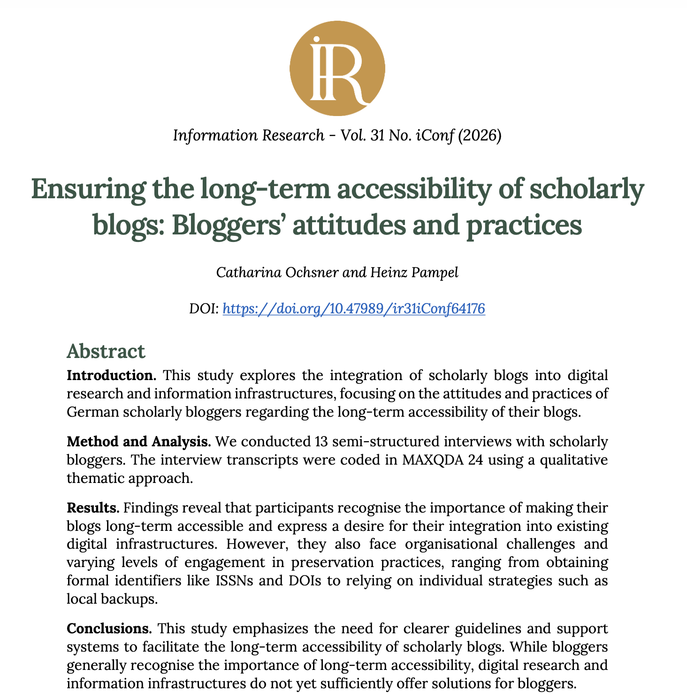

Wir freuen uns, Ihnen mitteilen zu können, dass unser Artikel “[Ensuring the long-term accessibility of scholarly blogs: Bloggers’ attitudes and practices](https://publicera.kb.se/ir/article/view/64176)” in [Information Research](https://publicera.kb.se/ir) veröffentlicht wurde. Der Artikel erscheint im Rahmen des Tagungsbands der [iConference 2026](https://www.ischools.org/iconference) die vom 29. März bis zum 2. April 2026 an der [Edinburgh Napier University](https://www.napier.ac.uk/) unter dem Motto “Information Literacies, Authenticity and Use: The Move Towards a Digitally Enlightened Society” stattfand. 

Abbildung 1: Screenshot des Artikels „Ensuring the long-term accessibility of scholarly blogs: Bloggers’ attitudes and practices“ [@ochsner2026]

Der Artikel befasst sich mit der Integration von Wissenschaftsblogs in digitale Forschungs- und Informationsinfrastrukturen. Auf der Grundlage von 13 halbstrukturierten Interviews haben wir die Einstellungen und Praktiken deutscher Wissenschaftsblogger:innen hinsichtlich der langfristigen Zugänglichkeit ihrer Blogs untersucht. Die Ergebnisse zeigen, dass die Teilnehmenden der langfristigen Zugänglichkeit ihrer Blogs eine hohe Bedeutung zuweisen und den Wunsch nach deren Integration in bestehende digitale Infrastrukturen äußern. Allerdings stehen Blogger:innen vor organisatorischen Herausforderungen, was zu einem unterschiedlichen Engagement bei der Archivierung führt – von der Beantragung formaler Identifikatoren wie ISSNs und DOIs bis hin zum Rückgriff auf individuelle Strategien wie lokale Backups. Wir fordern klare Richtlinien und verstärkte Unterstützung für Blogger:innen, um die langfristige Zugänglichkeit wissenschaftlicher Blogs zu erleichtern. [@ochsner2026]. Der Artikel kann [hier](https://doi.org/10.47989/ir31iConf64176) gefunden werden:

Ochsner, C., & Pampel, H. (2026). Ensuring the long-term accessibility of scholarly blogs: Bloggers’ attitudes and practices. Information Research an International Electronic Journal, 31(iConf), 1761–1769. https://doi.org/10.47989/ir31iConf64176

Die Folien zum Vortrag auf der iConference wurden auf Zenodo veröffentlicht und sind [hier](https://doi.org/10.5281/zenodo.19607536) auffindbar. Wir danken der iConference für die Gelegenheit, unsere Forschungsergebnisse vorzustellen, sowie den anonymen Gutachter:innen für ihr hilfreiches Feedback.

Further information about the research group can be found on our [official website](http://hu.berlin/infomgnt).

This text – excluding quotes and otherwise labelled parts – is licensed under the [CC BY 4.0 DEED](https://creativecommons.org/licenses/by/4.0/deed.de).
