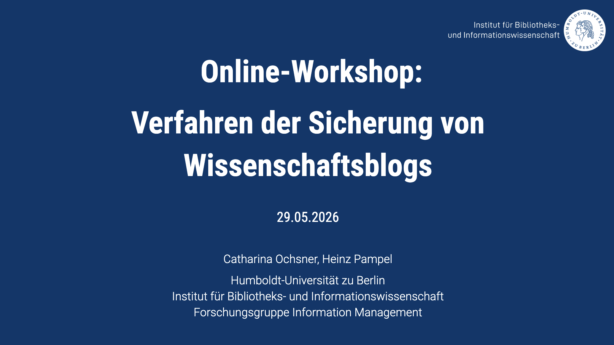

Im Rahmen des von der [Deutschen Forschungsgemeinschaft (DFG)](https://www.dfg.de/) geförderten Projekts [Infra Wiss Blogs](https://infrawissblogs.org/) haben wir am 29. Mai 2026 einen [Online-Workshop](https://www.ibi.hu-berlin.de/de/forschung/infomanagement/events/online-workshop-verfahren-der-sicherung-von-wissenschaftsblogs) zum Thema digitale Langzeitarchivierung von Blogs veranstaltet, mit dem Ziel, Exper:innen aus verschiedenen Einrichtungen der Informationsinfrastruktur zusammenzubringen, um bestehende Verfahren vorzustellen und gemeinsam zu diskutieren. Der Workshop wurde durch drei Vorträge von Expert:innen aus Infrastruktureinrichtungen bereichert, die bereits Blogs in ihren Beständen führen.

Ivo Vogel und Nihal Ariz vom [Fachinformationsdienst für internationale und interdisziplinäre Rechtsforschung -FID intRecht](https://intrecht.de/en/) stellten vor, wie Wissenschaftsblogs in das Repositorium [intRechtDok](https://intrechtdok.de/content/index.xml) integriert werden. Michael Czolkoß-Hettwer [vom Fachinformationsdienst Politikwissenschaft (Pollux)](https://pollux-fid.de/) sprach über die Aktitiväten zur Blog-Archivierung bei Pollux, während Jochen Walter vom [Deutschen Literaturarchiv (DLA)](https://www.dla-marbach.de/en/) Einblicke in die Archivierung digitaler Literatur und Blogs in die DLA-Infrastruktur gab. 

Alle Präsentationen wurden veröffentlicht:

Czolkoß-Hettwer, D. M. (2026, May 29). Wissenschaftsblogs & Pollux: Indexierungsverfahren und Unterstützung von Blogs bei der Langzeitverfügbarkeit. Zenodo. <https://doi.org/10.5281/zenodo.20491760>

Ochsner, C., & Pampel, H. (2026, May 29). Online-Workshop: Verfahren der Sicherung von Wissenschaftsblogs. Zenodo. <https://doi.org/10.5281/zenodo.20492209>

Vogel, I., Ariz, N., (2026). Von flüchtigen Blogposts zu zitierfähigen Forschungsressourcen: Wissenschaftsblogs in intRechtDok. <https://doi.org/10.17176/20260529-120200-0>

Walter, J. (2026, May 29). Verfahren der Sicherung von Blogs: Praxis am DLA Marbach. Zenodo. [https://doi.org/10.5281/zenodo.20526739](https://doi.org/10.5281/zenodo.20526739)

## Diskussion

Gemeinsam mit mehr als 30 Teilnehmenden aus Fachinformationsdiensten, Bibliotheken, Archiven und Forschungsinfrastrukturorganisationen diskutierten wir über Praktiken zur Integration von Blogs in digitale Forschungs- und Informationsinfrastrukturen. Die Diskussion zeigte, dass viele Institutionen vor ähnlichen Herausforderungen stehen. Ein zentrales Thema war die Frage, wie Diskussionen in und Querverweise zwischen Blogbeiträgen langfristig dokumentiert werden können. Während sich einzelne Antworten oder Folgebeiträge archivieren lassen, wurde deutlich, dass es technisch und organisatorisch schwierig ist, die gesamte Diskussionsgeschichte zu erfassen.

Darüber hinaus diskutierten die Teilnehmenden die Frage, welche Blogs als wissenschaftliche Blogs zu definieren sind. Dabei wurden Kriterien wie akademische Zugehörigkeit, redaktionelle Qualitätskontrolle und Redaktionsbeiräte erörtert. Gleichzeitig wurde deutlich, dass die Vielfalt der wissenschaftlichen Blogformate eine klare Abgrenzung erschwert. Mehrere Teilnehmende betonten die wachsende Relevanz von Blogs. Sie stellten fest, dass diese nicht mehr nur Kommunikationsmittel sind, sondern sich zunehmend zu eigenständigen Forschungsressourcen und Forschungsgegenständen in der wissenschaftlichen Kommunikation und ihrer Historie entwickeln.

## Fazit

Die Teilnehmenden waren sich einig, dass die langfristige Verfügbarkeit wissenschaftlicher Blogs weit mehr ist als eine rein technische Aufgabe. Sie erfordert das Zusammenspiel von Archivierung, Metadatenstandards, persistenten Identifikatoren, organisatorischen Prozessen und der Zusammenarbeit zwischen Blogbetreiber:innen und Infrastruktureinrichtungen. Gleichzeitig wurde deutlich, dass bereits heute praktikable Lösungen existieren. Ob durch Repositorien, Aggregatoren oder Archivierungsinitiativen – wissenschaftliche Blogs werden zunehmend als Teil der akademischen Publikationslandschaft anerkannt. Ihre Langzeitarchivierung ist somit nicht nur eine Frage der Verfügbarkeit, sondern auch der Sicherung der akademischen Kommunikation und des wissenschaftlichen Bestands.

Further information about the research group can be found on our [official website](http://hu.berlin/infomgnt).

This text – excluding quotes and otherwise labelled parts – is licensed under the [CC BY 4.0 DEED](https://creativecommons.org/licenses/by/4.0/deed.de).
